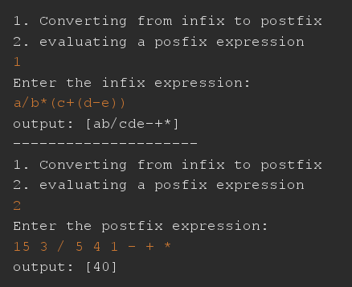

# infix-to-postfix
A Data Structure project that aims to
* convert an expression from infix to postfix.
* evaluate the postfix expression.
## Notes
* The implementation of the stack is linked list-based using generic types.

## requirements
* java compiler (JDK 20)
* java IDE (apatche netbeans 19)
## How to use
* Here is an example using variables when evaluating:

* Here is another example using just numbers in the postfix expression to evaluate:

